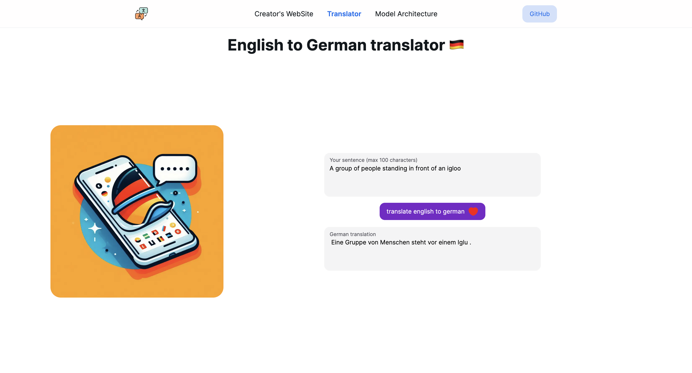

# English-to-German-translation-transformer



---

### DockerCompose (development)

```bash
# up the containers
docker compose -f docker-compose-dev.yaml up

# down the containers and remove images
docker compose -f docker-compose-dev.yaml down --rmi local
```

---

### DockerCompose (production)

```bash
# up the containers
docker compose -f docker-compose-prod.yaml up

# down the containers and remove images
docker compose -f docker-compose-prod.yaml down --rmi local
```

---

## Train & Val loss curve


---

## Number of parameters in the network 😎


- 37 million+ parameters 🤙🏻👨🏻‍🌾